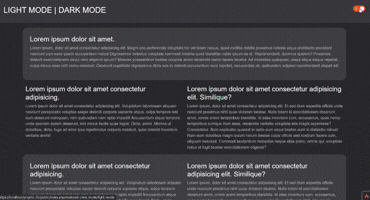

# 🌗 CodeIgniter 4 - Dark Mode & Light Mode

Projeto desenvolvido com CodeIgniter 4 demonstrando a implementação de alternância entre **Dark Mode** e **Light Mode**, utilizando cookies para persistência do tema selecionado.

---

## 🚀 Preview

<p align="center">
  
</p>

---

## 🛠 Tecnologias Utilizadas

- PHP 8.5
- CodeIgniter 4
- Bootstrap 5
- Cookies (persistência de tema)
- Helper personalizado (`color_mode_helper`)

---

## ⚙️ Como Funciona

O sistema utiliza:

- Helper personalizado para controle do tema
- Cookie para armazenar a preferência do usuário
- Carregamento dinâmico do CSS baseado no tema

### 📌 Exemplo no Layout:

```php
<link rel="stylesheet" href="<?= base_url('assets/css/' . check_color_mode() . '.css') ?>">
